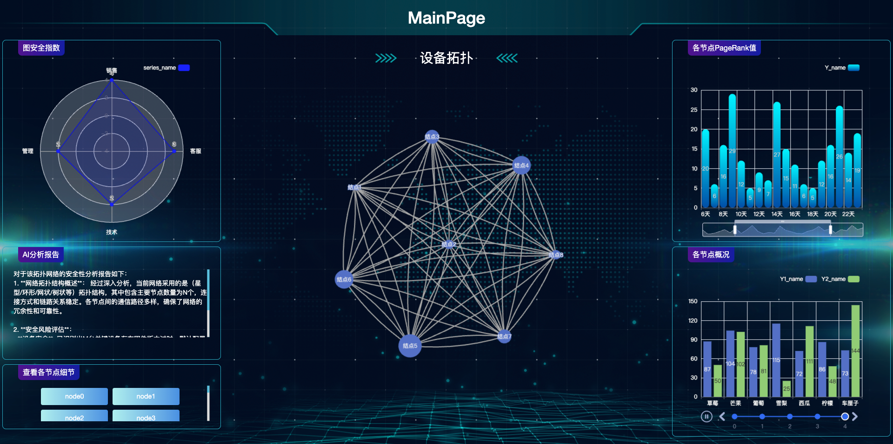
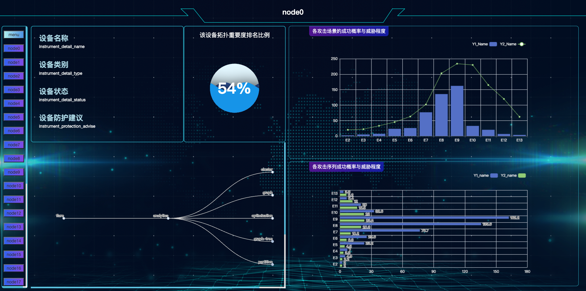

# git使用教程

- 一般步骤

```bash
git add . # 提交所有修改
git commit -m "add"  # 将本次提交注释为add 
git push origin master # 向远端仓库提交修改
```
- 拉取远端仓库代码

```bash
git pull
```

# 启动方式

1. 安装依赖：
```shell
pip install -r requirements.txt
```

2. 启动服务：

```shell
cd code
python main.py
```
# 详细参数

- 启动攻击方式聚类算法
```shell
python main.py --mode 'cluster_result'
```

- 启动Flask网页端
```shell
python main.py --mode 'webPage'
```

# 网页效果

- 主页面



- 子页面



# 泛ACT层分类
1. **软件攻击**：

- 恶意软件攻击
  - 病毒
    - 文件病毒
    - 引导区病毒
  - 木马
    - 后门木马
    - 远程访问木马
  - 蠕虫
    - 网络蠕虫
    - 电子邮件蠕虫
- 代码执行攻击
  - 缓冲区溢出
    - 栈溢出
    - 堆溢出
  - 代码注入
    - SQL注入
    - XSS（跨站脚本攻击）
      - 反射型XSS
      - 存储型XSS
- 逻辑攻击
  - DoS/DDoS（拒绝服务攻击）
    - 流量洪泛攻击
    - 应用层攻击
  - 零日攻击
  - 社交工程
    - 钓鱼攻击
    - 钓鱼邮件
- 操作系统攻击
  - 特权升级
    - 利用内核漏洞
    - 利用服务漏洞
  - 服务攻击
    - 远程服务漏洞利用
    - 本地服务漏洞利用
  - 配置弱点利用
    - 默认账户利用
    - 弱密码攻击
- 应用程序攻击
  - 浏览器攻击
    - 插件漏洞利用
    - 浏览器扩展攻击
  - 办公软件攻击
    - 宏病毒攻击
    - 文件格式漏洞利用
  - 其他应用软件攻击
    - PDF阅读器攻击
    - 多媒体播放器攻击

2. **网络攻击**：

- 中间人攻击
  - ARP欺骗
  - DNS欺骗
- IP地址欺骗
- 端口扫描
  - TCP扫描
  - UDP扫描
- Eavesdropping（监听）
  - 网络嗅探
  - 数据包捕获

3. **无线攻击**：

- Wi-Fi攻击
  - WEP破解
  - WPA/WPA2破解
  - Evil Twin攻击
- 蓝牙攻击
  - 蓝牙间谍软件
  - 蓝牙拒绝服务攻击
- RFID攻击
  - RFID克隆
  - RFID中间人攻击


4. **物理攻击**：

- 硬件篡改
  - 硬件植入
  - JTAG攻击
- 侧信道攻击
  - 功耗分析
  - 电磁分析
- 总线攻击
  - USB攻击
  - PCIe攻击
- 电磁攻击
  - TEMPEST攻击
  - EMP攻击


5. **其他攻击**：

- 供应链攻击
  - 硬件供应链攻击
  - 软件供应链攻击
- 冷启动攻击
- Rowhammer攻击
  - DRAM刷新漏洞利用